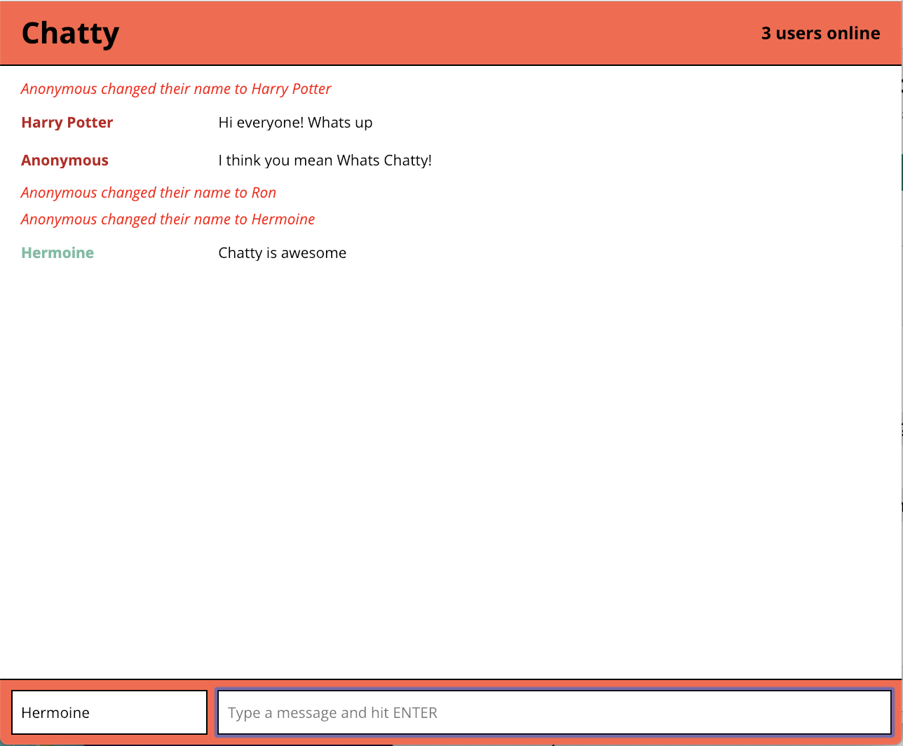
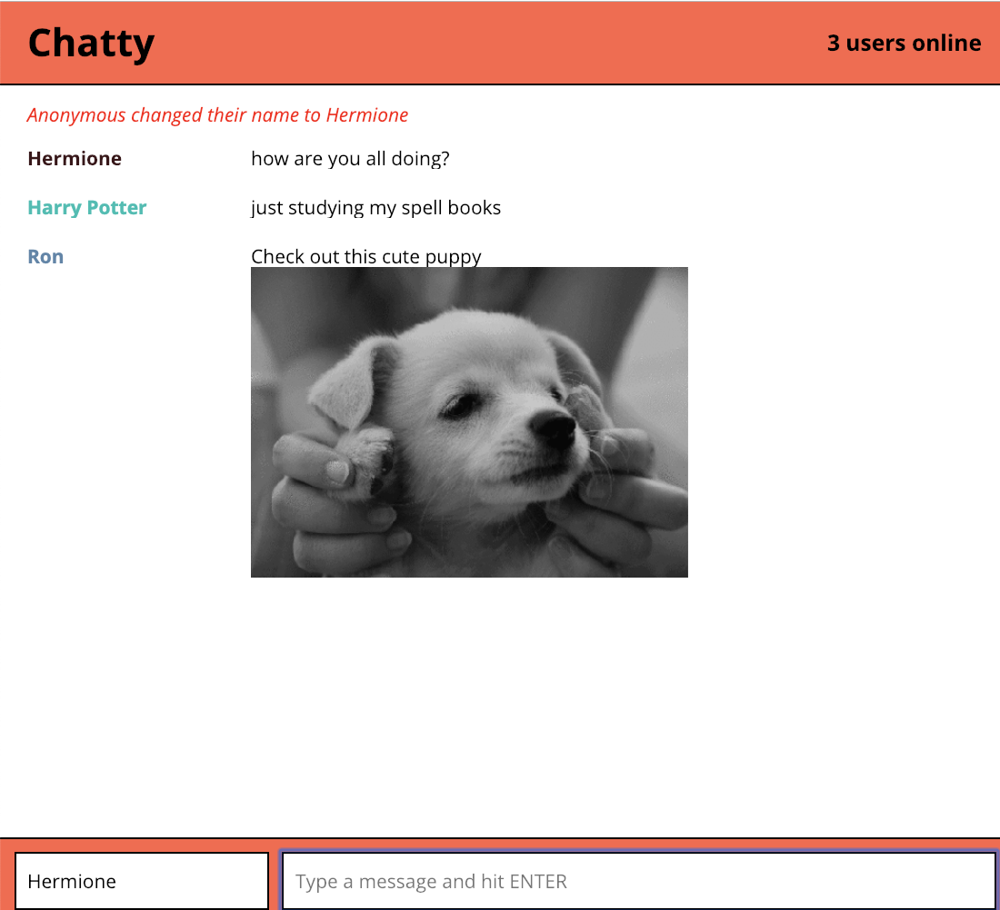
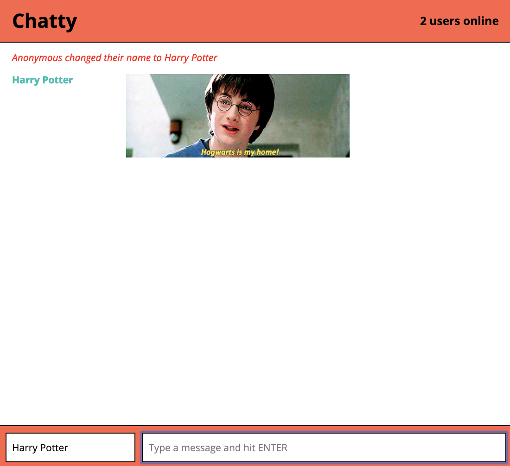

# Chatty App
=====================

A SPA, ChattyApp enables multiple users to chat with each other and receive real time updates. 

### Features

1. Connect to the app and view current number of active users (updated in real time)
2. Receive notifications when any user changes their name
3. Receive real time messages instantly
4. All users assigned a color to help distinguish different messages
5. If a user types in a message that contains an image url (ex. any url that ends with jpg, png, gif), the image is displayed with the message
6. Giphy integration - to share a gif from Giphy, a user can type /giphy searchterm. The first hit from the giphy search will be displayed.

### App Screenshot

### Project Stack

- Client Side: ReactJS
- Styling: Sass
- Server Side: Websockets

### Getting started
1. Install server side dependencies  in ./chatty_server 
2. Install dependencies on client side in ./ folder
3. Configure the .env file as described in the .env.example. An API Key from Giphy is required. 
4. Start both servers, the app loads on `http://localhost:3000`

### Dependencies

* React
* Webpack
* [babel-loader](https://github.com/babel/babel-loader)
* [webpack-dev-server](https://github.com/webpack/webpack-dev-server)
* ws
* express
* uuid
* dotenv
* Giphy API SDK wrapper

### Author
Sumedha Narayanan
